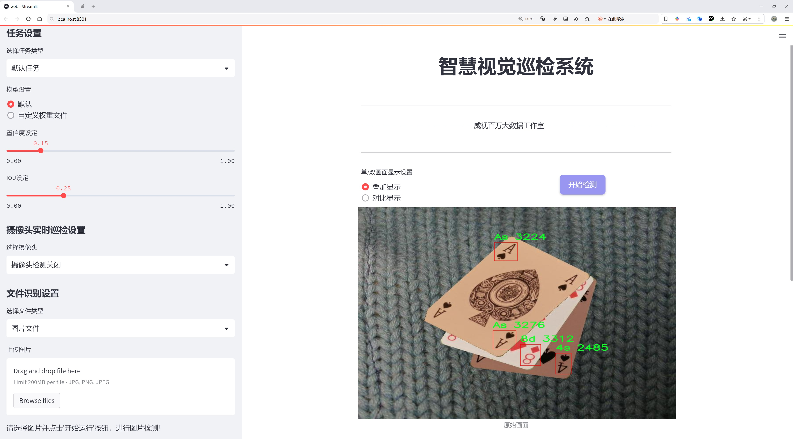
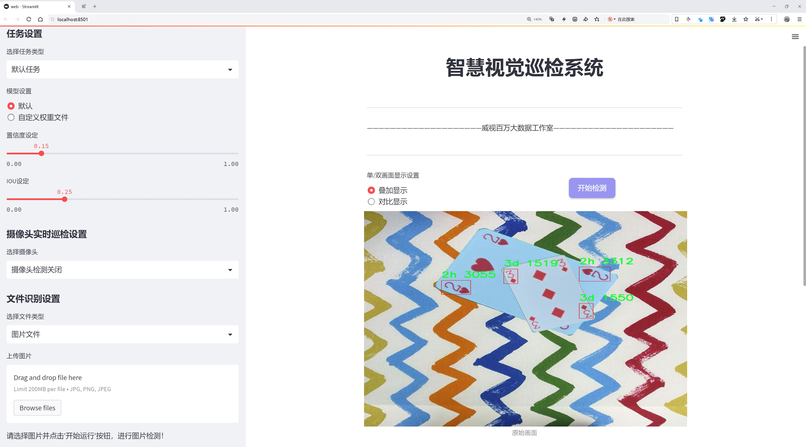
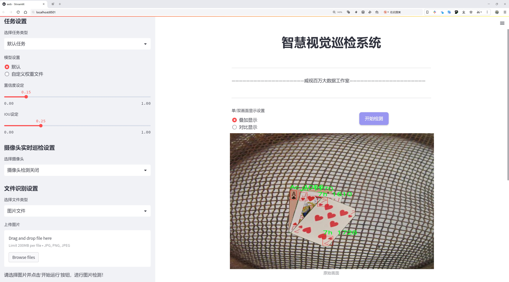
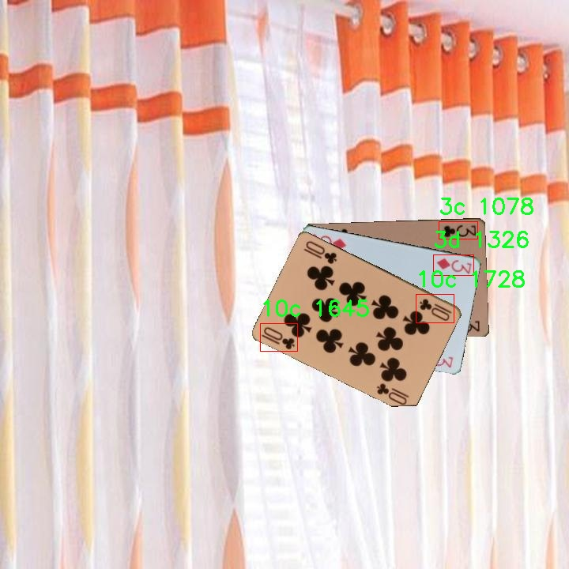
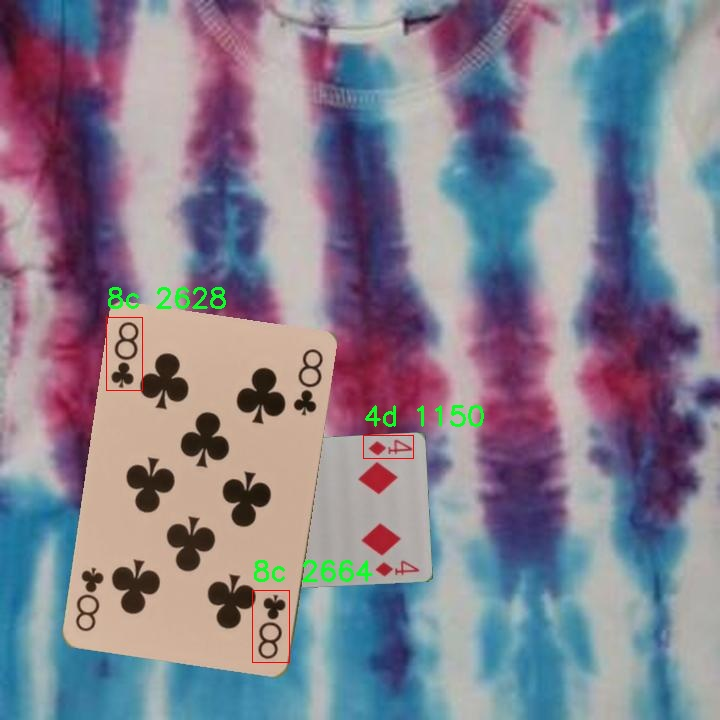
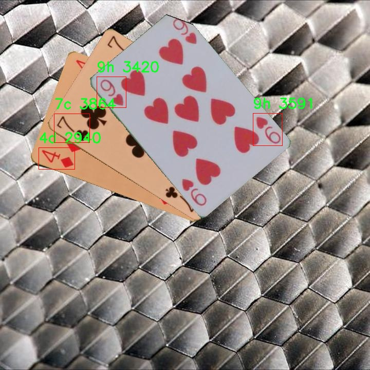
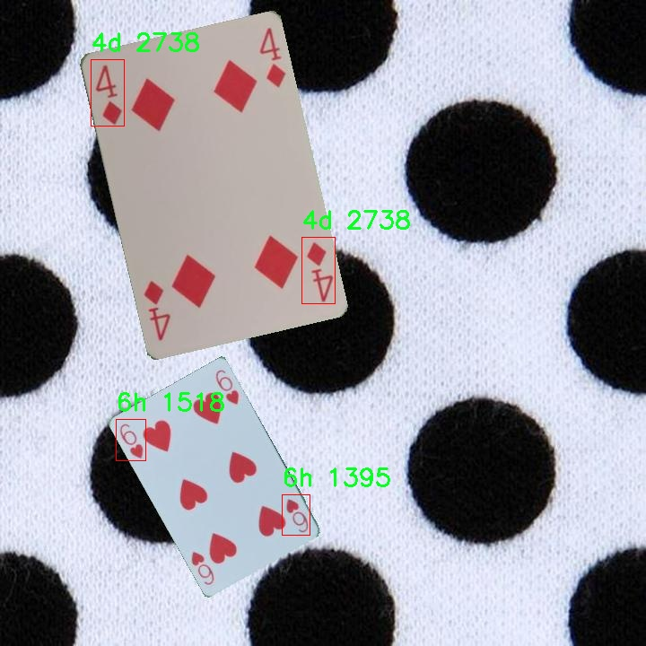
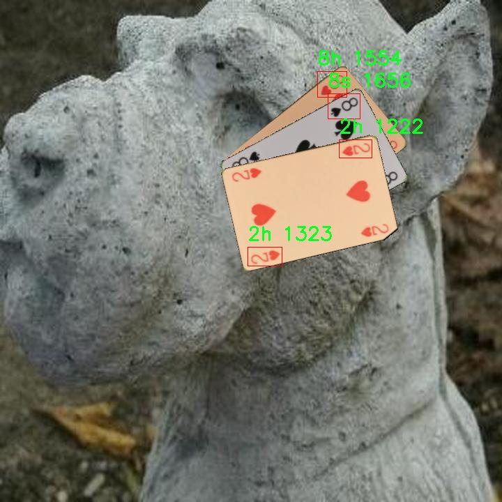

# 扑克牌识别系统源码分享
 # [一条龙教学YOLOV8标注好的数据集一键训练_70+全套改进创新点发刊_Web前端展示]

### 1.研究背景与意义

项目参考[AAAI Association for the Advancement of Artificial Intelligence](https://gitee.com/qunmasj/projects)

项目来源[AACV Association for the Advancement of Computer Vision](https://kdocs.cn/l/cszuIiCKVNis)

研究背景与意义

扑克牌作为一种广泛流行的娱乐和竞技工具，具有悠久的历史和丰富的文化内涵。随着科技的进步，扑克牌的应用场景逐渐扩展至智能游戏、在线娱乐、教育培训等多个领域。在这些应用中，扑克牌的自动识别和处理能力显得尤为重要。传统的扑克牌识别方法多依赖于人工识别或简单的图像处理技术，效率低下且易受环境因素的影响。为了解决这一问题，基于深度学习的目标检测技术逐渐成为研究的热点，其中YOLO（You Only Look Once）系列模型因其高效的实时检测能力而受到广泛关注。

YOLOv8作为YOLO系列的最新版本，结合了更先进的网络结构和训练策略，具备了更强的特征提取和分类能力。然而，尽管YOLOv8在许多物体检测任务中表现出色，但在扑克牌识别这一特定领域，仍然存在一定的挑战。扑克牌的种类繁多、外观相似且受光照、角度等因素的影响较大，这使得模型在识别时容易出现误判或漏判。因此，针对扑克牌的特征进行改进和优化，构建一个高效、准确的扑克牌识别系统，具有重要的研究意义。

本研究将基于改进的YOLOv8模型，针对扑克牌的特征进行深入分析和优化。我们使用的扑克牌数据集包含852张图像，涵盖了52种不同的扑克牌类别，具体包括从2到10的数字牌以及A、J、Q、K等面牌。这一数据集的多样性为模型的训练提供了丰富的样本，有助于提高模型的泛化能力和识别准确率。在数据集的构建过程中，我们将考虑到不同的拍摄角度、光照条件和背景干扰，以确保模型在实际应用中的鲁棒性。

通过对YOLOv8模型的改进，我们将探索多种技术手段，如数据增强、特征融合和模型集成等，以提升扑克牌的识别性能。研究的意义不仅在于提高扑克牌的自动识别效率，更在于为相关领域的智能化发展提供技术支持。例如，在在线扑克游戏中，快速准确的牌面识别可以提升用户体验，减少人为错误；在教育培训中，扑克牌识别系统可以辅助学习和游戏策略的分析。

综上所述，基于改进YOLOv8的扑克牌识别系统的研究，不仅具有重要的理论价值，也在实际应用中展现出广阔的前景。通过深入探讨扑克牌识别的技术路径，我们期望为智能识别技术的发展贡献新的思路和方法，推动相关领域的创新与进步。

### 2.图片演示







##### 注意：由于此博客编辑较早，上面“2.图片演示”和“3.视频演示”展示的系统图片或者视频可能为老版本，新版本在老版本的基础上升级如下：（实际效果以升级的新版本为准）

  （1）适配了YOLOV8的“目标检测”模型和“实例分割”模型，通过加载相应的权重（.pt）文件即可自适应加载模型。

  （2）支持“图片识别”、“视频识别”、“摄像头实时识别”三种识别模式。

  （3）支持“图片识别”、“视频识别”、“摄像头实时识别”三种识别结果保存导出，解决手动导出（容易卡顿出现爆内存）存在的问题，识别完自动保存结果并导出到tempDir中。

  （4）支持Web前端系统中的标题、背景图等自定义修改，后面提供修改教程。

  另外本项目提供训练的数据集和训练教程,暂不提供权重文件（best.pt）,需要您按照教程进行训练后实现图片演示和Web前端界面演示的效果。

### 3.视频演示

[3.1 视频演示](https://www.bilibili.com/video/BV1bp2AYmE9J/)

### 4.数据集信息展示

##### 4.1 本项目数据集详细数据（类别数＆类别名）

nc: 52
names: ['10c', '10d', '10h', '10s', '2c', '2d', '2h', '2s', '3c', '3d', '3h', '3s', '4c', '4d', '4h', '4s', '5c', '5d', '5h', '5s', '6c', '6d', '6h', '6s', '7c', '7d', '7h', '7s', '8c', '8d', '8h', '8s', '9c', '9d', '9h', '9s', 'Ac', 'Ad', 'Ah', 'As', 'Jc', 'Jd', 'Jh', 'Js', 'Kc', 'Kd', 'Kh', 'Ks', 'Qc', 'Qd', 'Qh', 'Qs']


##### 4.2 本项目数据集信息介绍

数据集信息展示

在本研究中，我们使用了名为“cards”的数据集，以改进YOLOv8的扑克牌识别系统。该数据集包含52个类别，涵盖了标准扑克牌的所有面值和花色，确保了系统在多样化场景下的准确性和鲁棒性。具体而言，这52个类别包括从2到10的数字牌，以及J（杰克）、Q（皇后）、K（国王）和A（王牌），每种牌都有四种花色：黑桃（s）、红心（h）、梅花（c）和方块（d）。这种分类的全面性使得数据集能够有效地训练模型，识别和区分不同的扑克牌。

数据集的构建过程经过精心设计，确保每个类别的样本数量均衡，以避免模型在训练过程中出现偏差。每张扑克牌的图像都经过高质量的采集和处理，确保在不同的光照条件和背景下，模型能够学习到扑克牌的特征。这些图像不仅包括标准的正面视图，还可能涵盖一定角度的侧面视图，以增强模型对扑克牌姿态变化的适应能力。此外，数据集中还包含了一些复杂场景的图像，例如多张扑克牌叠放在一起或与其他物体混合的情况，以提高模型在实际应用中的表现。

在训练过程中，YOLOv8模型将通过深度学习算法，利用该数据集进行特征提取和模式识别。数据集中的每个类别都将作为模型学习的基础，帮助其理解扑克牌的不同特征和细节。通过不断的迭代训练，模型将逐渐提高对扑克牌的识别准确率，最终实现快速且高效的识别能力。

为了评估模型的性能，我们将使用标准的评价指标，如准确率、召回率和F1分数。这些指标将帮助我们了解模型在不同类别上的表现，特别是在一些较少出现的牌面上。通过对模型的评估，我们可以进一步优化训练过程，调整超参数，以实现更好的识别效果。

总之，数据集“cards”不仅为改进YOLOv8的扑克牌识别系统提供了丰富的训练样本，也为后续的模型评估和优化奠定了坚实的基础。通过对扑克牌的全面覆盖和多样化场景的设计，该数据集将显著提升模型的识别能力，使其在实际应用中能够快速、准确地识别扑克牌，为相关领域的研究和应用提供强有力的支持。











### 5.全套项目环境部署视频教程（零基础手把手教学）

[5.1 环境部署教程链接（零基础手把手教学）](https://www.ixigua.com/7404473917358506534?logTag=c807d0cbc21c0ef59de5)


[5.2 安装Python虚拟环境创建和依赖库安装视频教程链接（零基础手把手教学）](https://www.ixigua.com/7404474678003106304?logTag=1f1041108cd1f708b01a)

### 6.手把手YOLOV8训练视频教程（零基础小白有手就能学会）

[6.1 手把手YOLOV8训练视频教程（零基础小白有手就能学会）](https://www.ixigua.com/7404477157818401292?logTag=d31a2dfd1983c9668658)


按照上面的训练视频教程链接加载项目提供的数据集，运行train.py即可开始训练



     Epoch   gpu_mem       box       obj       cls    labels  img_size
     1/200     20.8G   0.01576   0.01955  0.007536        22      1280: 100%|██████████| 849/849 [14:42<00:00,  1.04s/it]
               Class     Images     Labels          P          R     mAP@.5 mAP@.5:.95: 100%|██████████| 213/213 [01:14<00:00,  2.87it/s]
                 all       3395      17314      0.994      0.957      0.0957      0.0843

     Epoch   gpu_mem       box       obj       cls    labels  img_size
     2/200     20.8G   0.01578   0.01923  0.007006        22      1280: 100%|██████████| 849/849 [14:44<00:00,  1.04s/it]
               Class     Images     Labels          P          R     mAP@.5 mAP@.5:.95: 100%|██████████| 213/213 [01:12<00:00,  2.95it/s]
                 all       3395      17314      0.996      0.956      0.0957      0.0845

     Epoch   gpu_mem       box       obj       cls    labels  img_size
     3/200     20.8G   0.01561    0.0191  0.006895        27      1280: 100%|██████████| 849/849 [10:56<00:00,  1.29it/s]
               Class     Images     Labels          P          R     mAP@.5 mAP@.5:.95: 100%|███████   | 187/213 [00:52<00:00,  4.04it/s]
                 all       3395      17314      0.996      0.957      0.0957      0.0845


### 7.70+种全套YOLOV8创新点代码加载调参视频教程（一键加载写好的改进模型的配置文件）

[7.1 70+种全套YOLOV8创新点代码加载调参视频教程（一键加载写好的改进模型的配置文件）](https://www.ixigua.com/7404478314661806627?logTag=29066f8288e3f4eea3a4)

### 8.70+种全套YOLOV8创新点原理讲解（非科班也可以轻松写刊发刊，V10版本正在科研待更新）

#### 由于篇幅限制，每个创新点的具体原理讲解就不一一展开，具体见下列网址中的创新点对应子项目的技术原理博客网址【Blog】：


[8.1 70+种全套YOLOV8创新点原理讲解链接](https://gitee.com/qunmasj/good)

#### 部分改进原理讲解(完整的改进原理见上图和技术博客链接)【如果此小节的图加载失败可以通过CSDN或者Github搜索该博客的标题访问原始博客，原始博客图片显示正常】

### YOLOv8简介

按照官方描述，YOLOv8 是一个 SOTA 模型，它建立在以前 YOLO 版本的成功基础上，并引入了新的功能和改进，以进一步提升性能和灵活性。具体创新包括一个新的骨干网络、一个新的 Ancher-Free 检测头和一个新的损失函数，可以在从 CPU 到 GPU 的各种硬件平台上运行。

不过 ultralytics 并没有直接将开源库命名为 YOLOv8，而是直接使用 ultralytics 这个词，原因是 ultralytics 将这个库定位为算法框架，而非某一个特定算法，一个主要特点是可扩展性。其希望这个库不仅仅能够用于 YOLO 系列模型，而是能够支持非 YOLO 模型以及分类分割姿态估计等各类任务。
总而言之，ultralytics 开源库的两个主要优点是：

融合众多当前 SOTA 技术于一体
未来将支持其他 YOLO 系列以及 YOLO 之外的更多算法


下表为官方在 COCO Val 2017 数据集上测试的 mAP、参数量和 FLOPs 结果。可以看出 YOLOv8 相比 YOLOv5 精度提升非常多，但是 N/S/M 模型相应的参数量和 FLOPs 都增加了不少，从上图也可以看出相比 YOLOV5 大部分模型推理速度变慢了。


额外提一句，现在各个 YOLO 系列改进算法都在 COCO 上面有明显性能提升，但是在自定义数据集上面的泛化性还没有得到广泛验证，至今依然听到不少关于 YOLOv5 泛化性能较优异的说法。对各系列 YOLO 泛化性验证也是 MMYOLO 中一个特别关心和重点发力的方向。

### YOLO-MS简介
实时目标检测，以YOLO系列为例，已在工业领域中找到重要应用，特别是在边缘设备（如无人机和机器人）中。与之前的目标检测器不同，实时目标检测器旨在在速度和准确性之间追求最佳平衡。为了实现这一目标，提出了大量的工作：从第一代DarkNet到CSPNet，再到最近的扩展ELAN，随着性能的快速增长，实时目标检测器的架构经历了巨大的变化。

尽管性能令人印象深刻，但在不同尺度上识别对象仍然是实时目标检测器面临的基本挑战。这促使作者设计了一个强大的编码器架构，用于学习具有表现力的多尺度特征表示。具体而言，作者从两个新的角度考虑为实时目标检测编码多尺度特征：

从局部视角出发，作者设计了一个具有简单而有效的分层特征融合策略的MS-Block。受到Res2Net的启发，作者在MS-Block中引入了多个分支来进行特征提取，但不同的是，作者使用了一个带有深度卷积的 Inverted Bottleneck Block块，以实现对大Kernel的高效利用。

从全局视角出发，作者提出随着网络加深逐渐增加卷积的Kernel-Size。作者在浅层使用小Kernel卷积来更高效地处理高分辨率特征。另一方面，在深层中，作者采用大Kernel卷积来捕捉广泛的信息。

基于以上设计原则，作者呈现了作者的实时目标检测器，称为YOLO-MS。为了评估作者的YOLO-MS的性能，作者在MS COCO数据集上进行了全面的实验。还提供了与其他最先进方法的定量比较，以展示作者方法的强大性能。如图1所示，YOLO-MS在计算性能平衡方面优于其他近期的实时目标检测器。


具体而言，YOLO-MS-XS在MS COCO上获得了43%+的AP得分，仅具有450万个可学习参数和8.7亿个FLOPs。YOLO-MS-S和YOLO-MS分别获得了46%+和51%+的AP，可学习参数分别为810万和2220万。此外，作者的工作还可以作为其他YOLO模型的即插即用模块。通常情况下，作者的方法可以将YOLOv8的AP从37%+显著提高到40%+，甚至还可以使用更少的参数和FLOPs。


#### Multi-Scale Building Block Design
CSP Block是一个基于阶段级梯度路径的网络，平衡了梯度组合和计算成本。它是广泛应用于YOLO系列的基本构建块。已经提出了几种变体，包括YOLOv4和YOLOv5中的原始版本，Scaled YOLOv4中的CSPVoVNet，YOLOv7中的ELAN，以及RTMDet中提出的大Kernel单元。作者在图2(a)和图2(b)中分别展示了原始CSP块和ELAN的结构。


上述实时检测器中被忽视的一个关键方面是如何在基本构建块中编码多尺度特征。其中一个强大的设计原则是Res2Net，它聚合了来自不同层次的特征以增强多尺度表示。然而，这一原则并没有充分探索大Kernel卷积的作用，而大Kernel卷积已经在基于CNN的视觉识别任务模型中证明有效。将大Kernel卷积纳入Res2Net的主要障碍在于它们引入的计算开销，因为构建块采用了标准卷积。在作者的方法中，作者提出用 Inverted Bottleneck Block替代标准的3 × 3卷积，以享受大Kernel卷积的好处。

基于前面的分析，作者提出了一个带有分层特征融合策略的全新Block，称为MS-Block，以增强实时目标检测器在提取多尺度特征时的能力，同时保持快速的推理速度。

MS-Block的具体结构如图2(c)所示。假设是输入特征。通过1×1卷积的转换后，X的通道维度增加到n*C。然后，作者将X分割成n个不同的组，表示为，其中。为了降低计算成本，作者选择n为3。

注意，除了之外，每个其他组都经过一个 Inverted Bottleneck Block层，用表示，其中k表示Kernel-Size，以获得。的数学表示如下：


根据这个公式，该博客的作者不将 Inverted Bottleneck Block层连接，使其作为跨阶段连接，并保留来自前面层的信息。最后，作者将所有分割连接在一起，并应用1×1卷积来在所有分割之间进行交互，每个分割都编码不同尺度的特征。当网络加深时，这个1×1卷积也用于调整通道数。

#### Heterogeneous Kernel Selection Protocol
除了构建块的设计外，作者还从宏观角度探讨了卷积的使用。之前的实时目标检测器在不同的编码器阶段采用了同质卷积（即具有相同Kernel-Size的卷积），但作者认为这不是提取多尺度语义信息的最佳选项。

在金字塔结构中，从检测器的浅阶段提取的高分辨率特征通常用于捕捉细粒度语义，将用于检测小目标。相反，来自网络较深阶段的低分辨率特征用于捕捉高级语义，将用于检测大目标。如果作者在所有阶段都采用统一的小Kernel卷积，深阶段的有效感受野（ERF）将受到限制，影响大目标的性能。在每个阶段中引入大Kernel卷积可以帮助解决这个问题。然而，具有大的ERF的大Kernel可以编码更广泛的区域，这增加了在小目标外部包含噪声信息的概率，并且降低了推理速度。

在这项工作中，作者建议在不同阶段中采用异构卷积，以帮助捕获更丰富的多尺度特征。具体来说，在编码器的第一个阶段中，作者采用最小Kernel卷积，而最大Kernel卷积位于最后一个阶段。随后，作者逐步增加中间阶段的Kernel-Size，使其与特征分辨率的增加保持一致。这种策略允许提取细粒度和粗粒度的语义信息，增强了编码器的多尺度特征表示能力。

正如图所示，作者将k的值分别分配给编码器中的浅阶段到深阶段，取值为3、5、7和9。作者将其称为异构Kernel选择（HKS）协议。


作者的HKS协议能够在深层中扩大感受野，而不会对浅层产生任何其他影响。此外，HKS不仅有助于编码更丰富的多尺度特征，还确保了高效的推理。

如表1所示，将大Kernel卷积应用于高分辨率特征会产生较高的计算开销。然而，作者的HKS协议在低分辨率特征上采用大Kernel卷积，从而与仅使用大Kernel卷积相比，大大降低了计算成本。


在实践中，作者经验性地发现，采用HKS协议的YOLO-MS的推理速度几乎与仅使用深度可分离的3 × 3卷积相同。

#### Architecture
如图所示，作者模型的Backbone由4个阶段组成，每个阶段后面跟随1个步长为2的3 × 3卷积进行下采样。在第3个阶段后，作者添加了1个SPP块，与RTMDet中一样。在作者的编码器上，作者使用PAFPN作为Neck来构建特征金字塔[31, 35]。它融合了从Backbone不同阶段提取的多尺度特征。Neck中使用的基本构建块也是作者的MS-Block，在其中使用3 × 3深度可分离卷积进行快速推理。

此外，为了在速度和准确性之间取得更好的平衡，作者将Backbone中多级特征的通道深度减半。作者提供了3个不同尺度的YOLO-MS变体，即YOLO-MS-XS、YOLO-MS-S和YOLO-MS。不同尺度的YOLO-MS的详细配置列在表2中。对于YOLO-MS的其他部分，作者将其保持与RTMDet相同。


### 9.系统功能展示（检测对象为举例，实际内容以本项目数据集为准）

图9.1.系统支持检测结果表格显示

  图9.2.系统支持置信度和IOU阈值手动调节

  图9.3.系统支持自定义加载权重文件best.pt(需要你通过步骤5中训练获得)

  图9.4.系统支持摄像头实时识别

  图9.5.系统支持图片识别

  图9.6.系统支持视频识别

  图9.7.系统支持识别结果文件自动保存

  图9.8.系统支持Excel导出检测结果数据


### 10.原始YOLOV8算法原理

原始YOLOv8算法原理

YOLOv8算法作为YOLO系列中的最新版本，代表了目标检测领域的前沿技术，其设计理念和实现方式充分体现了单阶段检测算法的高效性与灵活性。与前代版本相比，YOLOv8在检测精度和速度上均有显著提升，成为计算机视觉任务中备受关注的解决方案。YOLOv8的架构主要由四个核心部分组成：输入层、Backbone骨干网络、Neck特征融合网络和Head检测模块，这些部分相互协作，形成了一个高效的目标检测系统。

在输入层，YOLOv8首先对输入图像进行预处理，包括图像的缩放、裁剪以及数据增强等操作。其中，Mosaic增强技术的引入，使得模型能够在训练过程中接触到更多样化的场景，从而提高其泛化能力。此外，YOLOv8还采用了自适应锚框计算和自适应灰度填充策略，这些技术的应用旨在提升模型对不同目标的检测能力和适应性。

Backbone部分是YOLOv8的特征提取模块，采用了改进的DarkNet结构。YOLOv8在这一部分引入了C2f模块，以替代传统的C3模块。C2f模块通过引入更多的分支和跨层连接，增强了特征图的梯度流动性，使得模型在特征学习上更为高效。与前代模型相比，C2f模块不仅保留了轻量级特性，还通过调整不同尺度模型的通道数，获得了更丰富的特征表示能力。此外，SPPF（Spatial Pyramid Pooling Fusion）模块的引入，使得YOLOv8能够对不同内核尺寸的特征图进行有效的合并处理，进一步提升了特征提取的效率。

Neck部分则采用了双塔结构，通过特征金字塔网络（FPN）和路径聚合网络（PAN）的结合，增强了网络对不同尺度目标的特征融合能力。这一设计使得YOLOv8能够更好地处理复杂场景中的多尺度目标，提升了模型的检测性能。特征金字塔网络通过多层次的特征图提取，确保了模型在不同层次上都能获取到丰富的语义信息，而路径聚合网络则有效地促进了特征的传递与融合，进一步增强了网络的特征表达能力。

在Head检测模块中，YOLOv8采用了解耦头的结构，将分类和回归任务分开处理。这一设计的优势在于能够加速模型的收敛速度，并提高目标检测的准确性。YOLOv8的检测模块包含三个Detect检测器，通过分离回归分支和预测分支，优化了模型的计算效率。损失计算过程也进行了改进，采用了Task-Aligned Assigner策略，根据分类与回归的分数加权结果选择正样本，从而提高了模型对目标的检测精度。在损失计算方面，YOLOv8结合了二元交叉熵损失（BCELoss）和分布焦点损失（DFLoss），以及完全交并比损失函数（CIOULoss），以提升模型对边界框预测的精准性。

YOLOv8在整体结构上进行了多项创新和优化，使得其在不同使用场景下都能展现出卓越的性能。根据不同的应用需求，YOLOv8提供了n、s、m、l、x五种不同的模型版本，深度逐渐加深，检测精度也随之提高。特别是YOLOv8n版本，以其最小的参数量和最快的检测速度，成为了实时目标检测任务中的理想选择。

总的来说，YOLOv8算法通过对网络结构的精心设计和优化，成功实现了在目标检测领域的重大突破。其高效的特征提取、灵活的特征融合以及精准的目标检测能力，使得YOLOv8在各种复杂场景下都能保持优异的表现。这些创新不仅提升了YOLOv8的实用性，也为未来的目标检测研究提供了新的思路和方向。随着YOLOv8的广泛应用，预计其将在智能监控、自动驾驶、无人机视觉等多个领域发挥重要作用，推动计算机视觉技术的进一步发展。


### 11.项目核心源码讲解（再也不用担心看不懂代码逻辑）

#### 11.1 ui.py

以下是经过精简和注释的核心代码部分：

```python
import sys
import subprocess
from QtFusion.path import abs_path

def run_script(script_path):
    """
    使用当前 Python 环境运行指定的脚本。

    Args:
        script_path (str): 要运行的脚本路径
    """
    # 获取当前 Python 解释器的路径
    python_path = sys.executable

    # 构建运行命令，使用 streamlit 运行指定的脚本
    command = f'"{python_path}" -m streamlit run "{script_path}"'

    # 执行命令并等待其完成
    result = subprocess.run(command, shell=True)
    
    # 检查命令执行结果，如果返回码不为0，表示出错
    if result.returncode != 0:
        print("脚本运行出错。")

# 主程序入口
if __name__ == "__main__":
    # 获取脚本的绝对路径
    script_path = abs_path("web.py")

    # 运行指定的脚本
    run_script(script_path)
```

### 代码注释说明：
1. **导入模块**：
   - `sys`：用于获取当前 Python 解释器的路径。
   - `subprocess`：用于执行外部命令。
   - `abs_path`：从 `QtFusion.path` 导入的函数，用于获取文件的绝对路径。

2. **`run_script` 函数**：
   - 接受一个参数 `script_path`，表示要运行的 Python 脚本的路径。
   - 使用 `sys.executable` 获取当前 Python 解释器的路径。
   - 构建命令字符串，使用 `streamlit` 模块运行指定的脚本。
   - 使用 `subprocess.run` 执行命令，并等待其完成。
   - 检查命令的返回码，如果不为0，则打印错误信息。

3. **主程序入口**：
   - 使用 `abs_path` 获取 `web.py` 的绝对路径。
   - 调用 `run_script` 函数运行该脚本。

这个文件名为 `ui.py`，它的主要功能是通过当前的 Python 环境来运行一个指定的脚本，具体来说是一个名为 `web.py` 的脚本。代码中首先导入了必要的模块，包括 `sys`、`os` 和 `subprocess`，以及一个自定义的 `abs_path` 函数，这个函数可能用于获取文件的绝对路径。

在 `run_script` 函数中，首先获取当前 Python 解释器的路径，这通过 `sys.executable` 实现。接着，构建一个命令字符串，这个命令会调用 `streamlit` 来运行指定的脚本。`streamlit` 是一个用于构建数据应用的框架，因此可以推测 `web.py` 可能是一个用于展示数据的应用。

然后，使用 `subprocess.run` 来执行这个命令。这个函数会在一个新的 shell 中运行命令，并等待其完成。如果脚本运行过程中出现错误，返回码不为零，程序会打印出“脚本运行出错”的提示信息。

在文件的最后部分，使用 `if __name__ == "__main__":` 来确保当这个文件作为主程序运行时，才会执行以下代码。这里指定了要运行的脚本路径，即通过 `abs_path` 函数获取的 `web.py` 的绝对路径，并调用 `run_script` 函数来执行这个脚本。

总体来说，这个文件的作用是为运行一个 Streamlit 应用提供一个简单的入口，确保用户可以通过 `ui.py` 来启动 `web.py` 脚本。

#### 11.2 70+种YOLOv8算法改进源码大全和调试加载训练教程（非必要）\ultralytics\nn\backbone\efficientViT.py

以下是简化后的核心代码，并附上详细的中文注释：

```python
import torch
import torch.nn as nn
import torch.nn.functional as F

# 定义一个卷积层和批归一化的组合
class Conv2d_BN(torch.nn.Sequential):
    def __init__(self, in_channels, out_channels, kernel_size=1, stride=1, padding=0):
        super().__init__()
        # 添加卷积层
        self.add_module('conv', nn.Conv2d(in_channels, out_channels, kernel_size, stride, padding, bias=False))
        # 添加批归一化层
        self.add_module('bn', nn.BatchNorm2d(out_channels))

    @torch.no_grad()
    def switch_to_deploy(self):
        # 将训练模式下的卷积和批归一化合并为一个卷积层，以便在推理时使用
        conv, bn = self._modules.values()
        w = bn.weight / (bn.running_var + bn.eps)**0.5
        w = conv.weight * w[:, None, None, None]
        b = bn.bias - bn.running_mean * bn.weight / (bn.running_var + bn.eps)**0.5
        return nn.Conv2d(w.size(1) * conv.groups, w.size(0), w.shape[2:], stride=conv.stride, padding=conv.padding, groups=conv.groups, bias=True).weight.data.copy_(w), b

# 定义一个简单的前馈神经网络
class FFN(nn.Module):
    def __init__(self, in_dim, hidden_dim):
        super().__init__()
        self.pw1 = Conv2d_BN(in_dim, hidden_dim)
        self.act = nn.ReLU()
        self.pw2 = Conv2d_BN(hidden_dim, in_dim, bn_weight_init=0)

    def forward(self, x):
        return self.pw2(self.act(self.pw1(x)))

# 定义EfficientViT的基本模块
class EfficientViTBlock(nn.Module):
    def __init__(self, in_dim, hidden_dim):
        super().__init__()
        self.dw0 = Conv2d_BN(in_dim, in_dim, kernel_size=3, padding=1, groups=in_dim)
        self.ffn0 = FFN(in_dim, hidden_dim)
        self.dw1 = Conv2d_BN(in_dim, in_dim, kernel_size=3, padding=1, groups=in_dim)
        self.ffn1 = FFN(in_dim, hidden_dim)

    def forward(self, x):
        x = self.ffn1(self.dw1(x))
        return x

# 定义EfficientViT模型
class EfficientViT(nn.Module):
    def __init__(self, img_size=224, embed_dim=[64, 128, 192], depth=[1, 2, 3]):
        super().__init__()
        self.patch_embed = Conv2d_BN(3, embed_dim[0] // 8, kernel_size=3, stride=2, padding=1)
        self.blocks = nn.ModuleList()
        for i in range(len(depth)):
            for _ in range(depth[i]):
                self.blocks.append(EfficientViTBlock(embed_dim[i], embed_dim[i] * 2))

    def forward(self, x):
        x = self.patch_embed(x)
        for block in self.blocks:
            x = block(x)
        return x

# 创建EfficientViT模型实例
if __name__ == '__main__':
    model = EfficientViT()
    inputs = torch.randn((1, 3, 640, 640))  # 输入一个640x640的RGB图像
    res = model(inputs)  # 前向传播
    print(res.size())  # 输出结果的尺寸
```

### 代码注释说明：
1. **Conv2d_BN**: 这个类定义了一个组合模块，包含卷积层和批归一化层，提供了一个方法来将训练时的两个层合并为一个卷积层以便于推理。
2. **FFN**: 这个类实现了一个简单的前馈神经网络，由两个卷积层和一个ReLU激活函数组成。
3. **EfficientViTBlock**: 这个类定义了EfficientViT的基本构建块，包含两个卷积层和两个前馈网络。
4. **EfficientViT**: 这个类实现了整个EfficientViT模型，包含了图像嵌入和多个EfficientViT块的堆叠。
5. **主程序**: 在主程序中创建了一个EfficientViT模型实例，并对一个随机生成的输入图像进行了前向传播，最后输出结果的尺寸。

该程序文件实现了EfficientViT模型的架构，主要用于计算机视觉任务。EfficientViT是一种高效的视觉变换器（Vision Transformer），通过多种模块的组合来提取图像特征。文件中包含了多个类和函数，每个部分都有其特定的功能。

首先，文件导入了必要的库，包括PyTorch和一些辅助模块。接着，定义了多个类，这些类构成了EfficientViT模型的基础。

`Conv2d_BN`类是一个包含卷积层和批归一化层的组合。它的构造函数接受多个参数，用于初始化卷积层和批归一化层，并且提供了一个方法`switch_to_deploy`，用于在推理阶段将卷积和批归一化融合为一个卷积层，以提高推理速度。

`replace_batchnorm`函数用于遍历网络中的所有子模块，将批归一化层替换为恒等映射，以减少推理时的计算量。

`PatchMerging`类实现了对特征图的合并操作，使用卷积和Squeeze-and-Excitation模块来增强特征表示。

`Residual`类实现了残差连接，允许在训练时引入随机失活，以提高模型的鲁棒性。

`FFN`类实现了前馈神经网络，由两个卷积层组成，带有ReLU激活函数。

`CascadedGroupAttention`和`LocalWindowAttention`类实现了注意力机制，前者用于全局特征的提取，后者则在局部窗口内进行特征的聚合。这些注意力机制通过卷积层进行查询、键和值的计算，并结合注意力偏置来增强模型的表达能力。

`EfficientViTBlock`类是EfficientViT的基本构建块，结合了卷积、前馈网络和注意力机制，形成一个完整的特征提取单元。

`EfficientViT`类是整个模型的核心，负责构建整个网络架构。它包含多个阶段，每个阶段由多个`EfficientViTBlock`组成。模型的输入图像经过一系列的卷积和注意力模块，最终输出多个特征图。

在文件的最后部分，定义了一些不同配置的EfficientViT模型（如`EfficientViT_m0`到`EfficientViT_m5`），每个配置有不同的参数设置，如嵌入维度、深度和头数等。

此外，还提供了多个函数（如`EfficientViT_M0`等）用于创建特定配置的模型，并支持加载预训练权重和批归一化的替换。

最后，在`__main__`部分，创建了一个EfficientViT模型实例，并对随机输入进行前向传播，输出各层的特征图尺寸。这段代码展示了如何使用该模型进行推理。

#### 11.3 code\ultralytics\models\yolo\segment\val.py

以下是代码中最核心的部分，并附上详细的中文注释：

```python
class SegmentationValidator(DetectionValidator):
    """
    扩展自 DetectionValidator 类的分割验证器，用于基于分割模型的验证。
    """

    def __init__(self, dataloader=None, save_dir=None, pbar=None, args=None, _callbacks=None):
        """初始化 SegmentationValidator，设置任务为 'segment'，并初始化指标为 SegmentMetrics。"""
        super().__init__(dataloader, save_dir, pbar, args, _callbacks)
        self.plot_masks = None  # 用于存储绘制的掩码
        self.process = None  # 掩码处理函数
        self.args.task = "segment"  # 设置任务类型为分割
        self.metrics = SegmentMetrics(save_dir=self.save_dir, on_plot=self.on_plot)  # 初始化指标

    def preprocess(self, batch):
        """预处理批次，将掩码转换为浮点数并发送到设备。"""
        batch = super().preprocess(batch)  # 调用父类的预处理方法
        batch["masks"] = batch["masks"].to(self.device).float()  # 将掩码转移到设备并转换为浮点数
        return batch

    def postprocess(self, preds):
        """后处理 YOLO 预测，返回输出检测结果和原型。"""
        p = ops.non_max_suppression(
            preds[0],
            self.args.conf,
            self.args.iou,
            labels=self.lb,
            multi_label=True,
            agnostic=self.args.single_cls,
            max_det=self.args.max_det,
            nc=self.nc,
        )  # 应用非极大值抑制以过滤重叠的检测
        proto = preds[1][-1] if len(preds[1]) == 3 else preds[1]  # 获取原型
        return p, proto  # 返回处理后的预测和原型

    def update_metrics(self, preds, batch):
        """更新指标，计算真阳性、假阳性等。"""
        for si, (pred, proto) in enumerate(zip(preds[0], preds[1])):
            self.seen += 1  # 记录已处理的样本数量
            npr = len(pred)  # 当前预测的数量
            stat = dict(
                conf=torch.zeros(0, device=self.device),
                pred_cls=torch.zeros(0, device=self.device),
                tp=torch.zeros(npr, self.niou, dtype=torch.bool, device=self.device),
                tp_m=torch.zeros(npr, self.niou, dtype=torch.bool, device=self.device),
            )  # 初始化统计信息
            pbatch = self._prepare_batch(si, batch)  # 准备当前批次的数据
            cls, bbox = pbatch.pop("cls"), pbatch.pop("bbox")  # 获取类别和边界框
            nl = len(cls)  # 目标数量
            stat["target_cls"] = cls  # 记录目标类别
            
            if npr == 0:  # 如果没有预测
                if nl:
                    for k in self.stats.keys():
                        self.stats[k].append(stat[k])  # 更新统计信息
                continue  # 跳过当前循环

            # 处理掩码
            gt_masks = pbatch.pop("masks")  # 获取真实掩码
            predn, pred_masks = self._prepare_pred(pred, pbatch, proto)  # 准备预测结果和掩码
            stat["conf"] = predn[:, 4]  # 记录置信度
            stat["pred_cls"] = predn[:, 5]  # 记录预测类别

            # 评估
            if nl:
                stat["tp"] = self._process_batch(predn, bbox, cls)  # 处理边界框
                stat["tp_m"] = self._process_batch(
                    predn, bbox, cls, pred_masks, gt_masks, self.args.overlap_mask, masks=True
                )  # 处理掩码
                # 处理混淆矩阵
                if self.args.plots:
                    self.confusion_matrix.process_batch(predn, bbox, cls)

            for k in self.stats.keys():
                self.stats[k].append(stat[k])  # 更新统计信息

    def _process_batch(self, detections, gt_bboxes, gt_cls, pred_masks=None, gt_masks=None, overlap=False, masks=False):
        """
        返回正确的预测矩阵。

        参数:
            detections (array[N, 6]), x1, y1, x2, y2, conf, class
            labels (array[M, 5]), class, x1, y1, x2, y2

        返回:
            correct (array[N, 10]), 对于 10 个 IoU 水平
        """
        if masks:
            # 处理掩码的逻辑
            if overlap:
                nl = len(gt_cls)
                index = torch.arange(nl, device=gt_masks.device).view(nl, 1, 1) + 1
                gt_masks = gt_masks.repeat(nl, 1, 1)  # 扩展掩码
                gt_masks = torch.where(gt_masks == index, 1.0, 0.0)  # 根据索引生成掩码
            if gt_masks.shape[1:] != pred_masks.shape[1:]:
                gt_masks = F.interpolate(gt_masks[None], pred_masks.shape[1:], mode="bilinear", align_corners=False)[0]
                gt_masks = gt_masks.gt_(0.5)  # 进行阈值处理
            iou = mask_iou(gt_masks.view(gt_masks.shape[0], -1), pred_masks.view(pred_masks.shape[0], -1))  # 计算掩码的 IoU
        else:  # 处理边界框
            iou = box_iou(gt_bboxes, detections[:, :4])  # 计算边界框的 IoU

        return self.match_predictions(detections[:, 5], gt_cls, iou)  # 匹配预测和真实标签

    def plot_predictions(self, batch, preds, ni):
        """绘制批次预测结果，包括掩码和边界框。"""
        plot_images(
            batch["img"],
            *output_to_target(preds[0], max_det=15),  # 绘制前 15 个检测结果
            torch.cat(self.plot_masks, dim=0) if len(self.plot_masks) else self.plot_masks,
            paths=batch["im_file"],
            fname=self.save_dir / f"val_batch{ni}_pred.jpg",  # 保存绘制结果
            names=self.names,
            on_plot=self.on_plot,
        )
        self.plot_masks.clear()  # 清空绘制的掩码
```

### 主要功能说明：
1. **SegmentationValidator 类**：该类扩展了 `DetectionValidator`，用于处理分割任务的验证过程。
2. **预处理和后处理**：`preprocess` 方法将掩码转换为浮点数，`postprocess` 方法对模型的预测结果进行后处理。
3. **指标更新**：`update_metrics` 方法负责更新各种指标，包括真阳性和假阳性等。
4. **IoU 计算**：`_process_batch` 方法计算预测与真实标签之间的 IoU，以评估模型性能。
5. **结果绘制**：`plot_predictions` 方法用于绘制预测结果，包括掩码和边界框，并保存到指定路径。

这个程序文件 `val.py` 是 Ultralytics YOLO 模型中的一个验证器类，专门用于基于分割模型的验证。它继承自 `DetectionValidator` 类，主要用于处理图像分割任务的评估和结果处理。

在初始化方法中，`SegmentationValidator` 设置了任务类型为“分割”，并初始化了一些用于计算分割性能的指标。该类的主要功能包括数据预处理、指标初始化、预测后处理、批次准备、更新指标、绘制验证样本和预测结果等。

在数据预处理阶段，程序将输入的掩码数据转换为浮点数并发送到指定的设备上。初始化指标时，根据是否需要保存 JSON 文件选择不同的掩码处理函数。该类还定义了如何格式化评估指标的描述。

预测后处理阶段，程序使用非极大值抑制方法对模型的预测结果进行处理，返回最终的检测结果和原型数据。批次准备方法则用于处理图像和目标数据，确保每个批次的数据格式正确。

在更新指标的方法中，程序会遍历每个预测结果，并与真实标签进行比较，计算正确预测的数量，并更新相应的统计数据。对于掩码的处理，程序还会根据设置选择是否使用重叠掩码。

在最终的指标计算中，程序会设置速度和混淆矩阵等评估指标。它还定义了一个处理批次的函数，计算检测结果与真实框或掩码之间的交并比（IoU），并返回正确的预测矩阵。

此外，程序提供了绘制验证样本和预测结果的功能，能够将带有边界框和掩码的图像保存为文件。最后，程序还实现了将预测结果保存为 JSON 格式的功能，以便后续评估。

整体来看，这个文件的主要目的是提供一个完整的框架，用于对分割模型的验证和评估，确保模型在实际应用中的性能和准确性。

#### 11.4 70+种YOLOv8算法改进源码大全和调试加载训练教程（非必要）\ultralytics\models\rtdetr\predict.py

以下是代码中最核心的部分，并附上详细的中文注释：

```python
import torch
from ultralytics.data.augment import LetterBox
from ultralytics.engine.predictor import BasePredictor
from ultralytics.engine.results import Results
from ultralytics.utils import ops

class RTDETRPredictor(BasePredictor):
    """
    RT-DETR（实时检测变换器）预测器，扩展自BasePredictor类，用于使用百度的RT-DETR模型进行预测。

    该类利用视觉变换器的强大功能，提供实时物体检测，同时保持高精度。它支持高效的混合编码和IoU感知查询选择等关键特性。
    """

    def postprocess(self, preds, img, orig_imgs):
        """
        对模型的原始预测结果进行后处理，以生成边界框和置信度分数。

        该方法根据置信度和类进行过滤，如果在`self.args`中指定了类。

        参数:
            preds (torch.Tensor): 模型的原始预测结果。
            img (torch.Tensor): 处理后的输入图像。
            orig_imgs (list或torch.Tensor): 原始未处理的图像。

        返回:
            (list[Results]): 包含后处理边界框、置信度分数和类标签的Results对象列表。
        """
        # 获取预测结果的维度
        nd = preds[0].shape[-1]
        # 将预测结果分割为边界框和分数
        bboxes, scores = preds[0].split((4, nd - 4), dim=-1)

        # 如果输入图像不是列表，则将其转换为numpy数组
        if not isinstance(orig_imgs, list):
            orig_imgs = ops.convert_torch2numpy_batch(orig_imgs)

        results = []
        for i, bbox in enumerate(bboxes):  # 遍历每个边界框
            # 将边界框从xywh格式转换为xyxy格式
            bbox = ops.xywh2xyxy(bbox)
            # 获取当前边界框的最大分数和对应的类
            score, cls = scores[i].max(-1, keepdim=True)
            # 根据置信度阈值过滤边界框
            idx = score.squeeze(-1) > self.args.conf
            # 如果指定了类，则进一步过滤
            if self.args.classes is not None:
                idx = (cls == torch.tensor(self.args.classes, device=cls.device)).any(1) & idx
            # 过滤后的预测结果
            pred = torch.cat([bbox, score, cls], dim=-1)[idx]
            orig_img = orig_imgs[i]
            oh, ow = orig_img.shape[:2]  # 获取原始图像的高度和宽度
            # 将边界框坐标缩放到原始图像的尺寸
            pred[..., [0, 2]] *= ow
            pred[..., [1, 3]] *= oh
            img_path = self.batch[0][i]  # 获取图像路径
            # 将结果添加到列表中
            results.append(Results(orig_img, path=img_path, names=self.model.names, boxes=pred))
        return results

    def pre_transform(self, im):
        """
        在将输入图像传递给模型进行推理之前，对其进行预处理。输入图像被调整为正方形并填充比例。

        参数:
            im (list[np.ndarray] | torch.Tensor): 输入图像，形状为(N,3,h,w)的张量，或[(h,w,3) x N]的列表。

        返回:
            (list): 预处理后的图像列表，准备进行模型推理。
        """
        # 创建LetterBox对象以进行图像调整
        letterbox = LetterBox(self.imgsz, auto=False, scaleFill=True)
        # 对每个图像进行调整并返回
        return [letterbox(image=x) for x in im]
```

### 代码核心部分说明：
1. **RTDETRPredictor类**：这是一个用于实时物体检测的预测器，继承自`BasePredictor`，使用百度的RT-DETR模型。
2. **postprocess方法**：负责处理模型的原始预测结果，生成边界框和置信度分数，并根据置信度和类进行过滤。
3. **pre_transform方法**：在模型推理之前对输入图像进行预处理，确保图像为正方形并填充比例，以适应模型的输入要求。

这个程序文件是一个用于实时目标检测的预测器，名为`RTDETRPredictor`，它扩展了`BasePredictor`类，主要用于使用百度的RT-DETR模型进行预测。RT-DETR是一种结合了视觉变换器（Vision Transformers）技术的模型，旨在实现高效的实时目标检测，同时保持较高的准确性。该类支持一些关键特性，如高效的混合编码和IoU（Intersection over Union）感知的查询选择。

在代码中，首先导入了必要的库和模块，包括`torch`和一些来自`ultralytics`的工具。接着定义了`RTDETRPredictor`类，该类包含了几个重要的方法和属性。

`postprocess`方法用于对模型的原始预测结果进行后处理，以生成边界框和置信度分数。该方法会根据置信度和类别进行过滤。具体来说，它首先将预测结果分割为边界框和分数，然后将输入的原始图像转换为numpy格式（如果它们不是列表的话）。接下来，方法遍历每个边界框，转换坐标格式，并根据置信度和类别进行筛选，最终生成一个包含后处理结果的`Results`对象列表。

`pre_transform`方法则负责在将输入图像传入模型进行推理之前，对其进行预处理。它使用`LetterBox`类将输入图像调整为正方形，并确保填充比例正确。该方法接受的输入可以是一个张量或一个图像列表，返回的是一个经过预处理的图像列表，准备好进行模型推理。

总体来说，这个文件提供了一个完整的框架，用于通过RT-DETR模型进行目标检测的预测，涵盖了从图像预处理到结果后处理的整个流程。通过示例代码，可以看到如何使用这个预测器进行推理，传入模型参数和数据源，最终得到检测结果。

#### 11.5 code\ultralytics\models\sam\modules\decoders.py

以下是代码中最核心的部分，并附上详细的中文注释：

```python
import torch
from torch import nn
from typing import Tuple

class MaskDecoder(nn.Module):
    """
    MaskDecoder类用于生成掩码及其质量评分，使用变换器架构根据图像和提示嵌入预测掩码。
    """

    def __init__(self, transformer_dim: int, transformer: nn.Module, num_multimask_outputs: int = 3) -> None:
        """
        初始化MaskDecoder类。

        参数:
            transformer_dim (int): 变换器模块的通道维度
            transformer (nn.Module): 用于预测掩码的变换器
            num_multimask_outputs (int): 预测的掩码数量
        """
        super().__init__()
        self.transformer_dim = transformer_dim  # 变换器的通道维度
        self.transformer = transformer  # 变换器模块

        self.num_multimask_outputs = num_multimask_outputs  # 多掩码输出的数量

        # 定义IoU（Intersection over Union）嵌入
        self.iou_token = nn.Embedding(1, transformer_dim)
        # 定义掩码嵌入
        self.mask_tokens = nn.Embedding(num_multimask_outputs + 1, transformer_dim)

        # 输出上采样网络
        self.output_upscaling = nn.Sequential(
            nn.ConvTranspose2d(transformer_dim, transformer_dim // 4, kernel_size=2, stride=2),
            nn.LayerNorm(transformer_dim // 4),
            nn.GELU(),
            nn.ConvTranspose2d(transformer_dim // 4, transformer_dim // 8, kernel_size=2, stride=2),
            nn.GELU(),
        )

        # 定义用于生成掩码的超网络MLP
        self.output_hypernetworks_mlps = nn.ModuleList(
            [MLP(transformer_dim, transformer_dim, transformer_dim // 8, 3) for _ in range(num_multimask_outputs + 1)]
        )

        # 定义用于预测掩码质量的MLP
        self.iou_prediction_head = MLP(transformer_dim, 256, num_multimask_outputs + 1, 3)

    def forward(
        self,
        image_embeddings: torch.Tensor,
        image_pe: torch.Tensor,
        sparse_prompt_embeddings: torch.Tensor,
        dense_prompt_embeddings: torch.Tensor,
        multimask_output: bool,
    ) -> Tuple[torch.Tensor, torch.Tensor]:
        """
        根据图像和提示嵌入预测掩码。

        参数:
            image_embeddings (torch.Tensor): 图像编码器的嵌入
            image_pe (torch.Tensor): 图像嵌入的位置信息
            sparse_prompt_embeddings (torch.Tensor): 稀疏提示的嵌入
            dense_prompt_embeddings (torch.Tensor): 密集提示的嵌入
            multimask_output (bool): 是否返回多个掩码

        返回:
            torch.Tensor: 预测的掩码
            torch.Tensor: 掩码质量的预测
        """
        masks, iou_pred = self.predict_masks(
            image_embeddings=image_embeddings,
            image_pe=image_pe,
            sparse_prompt_embeddings=sparse_prompt_embeddings,
            dense_prompt_embeddings=dense_prompt_embeddings,
        )

        # 根据是否需要多个掩码选择输出
        mask_slice = slice(1, None) if multimask_output else slice(0, 1)
        masks = masks[:, mask_slice, :, :]
        iou_pred = iou_pred[:, mask_slice]

        return masks, iou_pred

    def predict_masks(
        self,
        image_embeddings: torch.Tensor,
        image_pe: torch.Tensor,
        sparse_prompt_embeddings: torch.Tensor,
        dense_prompt_embeddings: torch.Tensor,
    ) -> Tuple[torch.Tensor, torch.Tensor]:
        """
        预测掩码。

        参数:
            image_embeddings (torch.Tensor): 图像编码器的嵌入
            image_pe (torch.Tensor): 图像嵌入的位置信息
            sparse_prompt_embeddings (torch.Tensor): 稀疏提示的嵌入
            dense_prompt_embeddings (torch.Tensor): 密集提示的嵌入

        返回:
            torch.Tensor: 预测的掩码
            torch.Tensor: 掩码质量的预测
        """
        # 连接输出令牌
        output_tokens = torch.cat([self.iou_token.weight, self.mask_tokens.weight], dim=0)
        output_tokens = output_tokens.unsqueeze(0).expand(sparse_prompt_embeddings.size(0), -1, -1)
        tokens = torch.cat((output_tokens, sparse_prompt_embeddings), dim=1)

        # 扩展每个图像的数据以适应每个掩码
        src = torch.repeat_interleave(image_embeddings, tokens.shape[0], dim=0)
        src = src + dense_prompt_embeddings
        pos_src = torch.repeat_interleave(image_pe, tokens.shape[0], dim=0)

        # 运行变换器
        hs, src = self.transformer(src, pos_src, tokens)
        iou_token_out = hs[:, 0, :]  # IoU令牌的输出
        mask_tokens_out = hs[:, 1 : (1 + self.num_multimask_outputs), :]  # 掩码令牌的输出

        # 上采样掩码嵌入并使用掩码令牌预测掩码
        src = src.transpose(1, 2).view(src.shape[0], src.shape[1], -1)
        upscaled_embedding = self.output_upscaling(src)
        hyper_in_list = [
            self.output_hypernetworks_mlps[i](mask_tokens_out[:, i, :]) for i in range(self.num_multimask_outputs + 1)
        ]
        hyper_in = torch.stack(hyper_in_list, dim=1)
        masks = (hyper_in @ upscaled_embedding.view(upscaled_embedding.shape[0], upscaled_embedding.shape[1], -1)).view(upscaled_embedding.shape[0], -1, upscaled_embedding.shape[2], upscaled_embedding.shape[3])

        # 生成掩码质量预测
        iou_pred = self.iou_prediction_head(iou_token_out)

        return masks, iou_pred


class MLP(nn.Module):
    """
    多层感知器（MLP）模型，用于掩码预测。
    """

    def __init__(self, input_dim: int, hidden_dim: int, output_dim: int, num_layers: int) -> None:
        """
        初始化MLP模型。

        参数:
            input_dim (int): 输入特征的维度
            hidden_dim (int): 隐藏层的维度
            output_dim (int): 输出层的维度
            num_layers (int): 隐藏层的数量
        """
        super().__init__()
        self.layers = nn.ModuleList(
            nn.Linear(n, k) for n, k in zip([input_dim] + [hidden_dim] * (num_layers - 1), [hidden_dim] * (num_layers - 1) + [output_dim])
        )

    def forward(self, x):
        """执行前向传播并应用激活函数。"""
        for i, layer in enumerate(self.layers):
            x = F.relu(layer(x)) if i < len(self.layers) - 1 else layer(x)
        return x
```

### 代码核心部分解释：
1. **MaskDecoder类**：这是主要的掩码解码器，负责根据输入的图像嵌入和提示嵌入生成掩码和质量评分。
   - **初始化方法**：设置变换器的维度、变换器模块、IoU嵌入、掩码嵌入和输出上采样网络。
   - **forward方法**：接收输入并调用`predict_masks`方法生成掩码和质量评分。
   - **predict_masks方法**：执行掩码的预测，连接输出令牌，运行变换器并生成最终的掩码和质量评分。

2. **MLP类**：多层感知器，用于生成掩码质量评分。
   - **初始化方法**：定义输入层、隐藏层和输出层。
   - **forward方法**：执行前向传播，应用ReLU激活函数。

以上是代码的核心部分及其详细注释，帮助理解其功能和结构。

这个程序文件定义了一个名为 `MaskDecoder` 的类，它是一个用于生成图像掩码和相应质量评分的解码器模块，采用了变换器（Transformer）架构。该类的主要功能是根据图像和提示嵌入来预测掩码。

在 `MaskDecoder` 类的构造函数中，初始化了一些重要的属性，包括变换器的维度、变换器模块、需要预测的掩码数量、IoU（Intersection over Union）嵌入、掩码嵌入、输出上采样的神经网络序列、用于生成掩码的超网络多层感知机（MLP）以及用于预测掩码质量的MLP。

`forward` 方法是类的主要接口，它接收图像嵌入、图像位置编码、稀疏提示嵌入、密集提示嵌入和一个布尔值（指示是否返回多个掩码）。该方法调用 `predict_masks` 方法来生成掩码和IoU预测，然后根据 `multimask_output` 的值选择输出的掩码和IoU预测。

`predict_masks` 方法负责实际的掩码预测。它首先将IoU和掩码嵌入连接起来，并与稀疏提示嵌入一起形成输入令牌。接着，它将图像嵌入和密集提示嵌入结合，扩展到每个掩码的维度，并通过变换器进行处理。最后，经过上采样和超网络MLP的处理，生成最终的掩码和IoU预测。

此外，文件中还定义了一个 `MLP` 类，它是一个多层感知机模型。该类的构造函数接收输入维度、隐藏层维度、输出维度和层数等参数，并构建相应的线性层。`forward` 方法则执行前向传播，并在最后一层应用激活函数（如果需要的话）。

整体来看，这个文件实现了一个复杂的掩码生成模型，结合了深度学习中的变换器架构和多层感知机，旨在处理图像分割任务。

#### 11.6 train.py

以下是经过简化和注释的核心代码部分：

```python
import random
import numpy as np
import torch.nn as nn
from ultralytics.data import build_dataloader, build_yolo_dataset
from ultralytics.engine.trainer import BaseTrainer
from ultralytics.models import yolo
from ultralytics.nn.tasks import DetectionModel
from ultralytics.utils import LOGGER, RANK
from ultralytics.utils.torch_utils import de_parallel, torch_distributed_zero_first

class DetectionTrainer(BaseTrainer):
    """
    基于检测模型的训练类，继承自BaseTrainer类。
    """

    def build_dataset(self, img_path, mode="train", batch=None):
        """
        构建YOLO数据集。

        参数:
            img_path (str): 图像文件夹的路径。
            mode (str): 模式，可以是'train'或'val'，用于不同的数据增强。
            batch (int, optional): 批次大小，适用于'rect'模式。默认为None。
        """
        gs = max(int(de_parallel(self.model).stride.max() if self.model else 0), 32)  # 获取模型的最大步幅
        return build_yolo_dataset(self.args, img_path, batch, self.data, mode=mode, rect=mode == "val", stride=gs)

    def get_dataloader(self, dataset_path, batch_size=16, rank=0, mode="train"):
        """构建并返回数据加载器。"""
        assert mode in ["train", "val"]  # 确保模式有效
        with torch_distributed_zero_first(rank):  # 仅在DDP情况下初始化数据集.cache一次
            dataset = self.build_dataset(dataset_path, mode, batch_size)  # 构建数据集
        shuffle = mode == "train"  # 训练模式下打乱数据
        workers = self.args.workers if mode == "train" else self.args.workers * 2  # 根据模式设置工作线程数
        return build_dataloader(dataset, batch_size, workers, shuffle, rank)  # 返回数据加载器

    def preprocess_batch(self, batch):
        """对图像批次进行预处理，包括缩放和转换为浮点数。"""
        batch["img"] = batch["img"].to(self.device, non_blocking=True).float() / 255  # 将图像转换为浮点数并归一化
        if self.args.multi_scale:  # 如果启用多尺度
            imgs = batch["img"]
            sz = (
                random.randrange(self.args.imgsz * 0.5, self.args.imgsz * 1.5 + self.stride)
                // self.stride
                * self.stride
            )  # 随机选择新的图像大小
            sf = sz / max(imgs.shape[2:])  # 计算缩放因子
            if sf != 1:  # 如果需要缩放
                ns = [
                    math.ceil(x * sf / self.stride) * self.stride for x in imgs.shape[2:]
                ]  # 计算新的形状
                imgs = nn.functional.interpolate(imgs, size=ns, mode="bilinear", align_corners=False)  # 进行插值缩放
            batch["img"] = imgs  # 更新批次图像
        return batch

    def get_model(self, cfg=None, weights=None, verbose=True):
        """返回YOLO检测模型。"""
        model = DetectionModel(cfg, nc=self.data["nc"], verbose=verbose and RANK == -1)  # 创建检测模型
        if weights:
            model.load(weights)  # 加载权重
        return model

    def plot_training_samples(self, batch, ni):
        """绘制训练样本及其注释。"""
        plot_images(
            images=batch["img"],
            batch_idx=batch["batch_idx"],
            cls=batch["cls"].squeeze(-1),
            bboxes=batch["bboxes"],
            paths=batch["im_file"],
            fname=self.save_dir / f"train_batch{ni}.jpg",
            on_plot=self.on_plot,
        )

    def plot_metrics(self):
        """从CSV文件中绘制指标。"""
        plot_results(file=self.csv, on_plot=self.on_plot)  # 保存结果图
```

### 代码注释说明：
1. **导入模块**：导入必要的库和模块，包括数据处理、模型构建和可视化工具。
2. **DetectionTrainer类**：该类用于处理YOLO模型的训练，继承自基础训练类`BaseTrainer`。
3. **build_dataset方法**：构建YOLO数据集，接受图像路径、模式和批次大小作为参数。
4. **get_dataloader方法**：创建数据加载器，支持分布式训练，并根据模式选择是否打乱数据。
5. **preprocess_batch方法**：对输入的图像批次进行预处理，包括归一化和多尺度调整。
6. **get_model方法**：返回一个YOLO检测模型，并可选择加载预训练权重。
7. **plot_training_samples方法**：可视化训练样本及其标注，便于检查数据的正确性。
8. **plot_metrics方法**：从CSV文件中绘制训练过程中的指标，帮助监控训练效果。

这个程序文件 `train.py` 是一个用于训练目标检测模型的脚本，主要基于 YOLO（You Only Look Once）架构。程序中定义了一个 `DetectionTrainer` 类，该类继承自 `BaseTrainer`，并实现了一系列与训练过程相关的方法。

首先，程序导入了必要的库和模块，包括数学运算、随机数生成、深度学习框架 PyTorch 相关的模块，以及 Ultralytics 提供的工具和数据处理模块。接着，`DetectionTrainer` 类的文档字符串给出了该类的用途和示例用法，展示了如何使用该类进行模型训练。

在 `DetectionTrainer` 类中，`build_dataset` 方法用于构建 YOLO 数据集。它接收图像路径、模式（训练或验证）和批次大小作为参数，并根据模型的步幅（stride）构建数据集。`get_dataloader` 方法则负责创建数据加载器，确保在分布式训练时只初始化一次数据集，并根据模式决定是否打乱数据。

`preprocess_batch` 方法对图像批次进行预处理，包括将图像缩放到合适的大小并转换为浮点数。这里还实现了多尺度训练的功能，通过随机选择图像的大小来增强模型的鲁棒性。

`set_model_attributes` 方法用于设置模型的属性，包括类别数量和类别名称等。`get_model` 方法返回一个 YOLO 检测模型实例，并可选择加载预训练权重。`get_validator` 方法返回一个用于模型验证的 `DetectionValidator` 实例。

`label_loss_items` 方法用于返回带有标签的训练损失项字典，适用于分割和检测任务。`progress_string` 方法生成一个格式化的字符串，用于显示训练进度，包括当前的 epoch、GPU 内存使用情况、损失值等信息。

`plot_training_samples` 方法用于绘制训练样本及其标注，便于可视化训练过程中的数据。最后，`plot_metrics` 和 `plot_training_labels` 方法分别用于绘制训练过程中的指标和标签，帮助用户分析模型的训练效果。

整体来看，这个文件实现了 YOLO 模型训练的核心功能，提供了数据集构建、数据加载、模型设置、损失计算和可视化等一系列功能，为用户提供了一个完整的训练框架。

### 12.系统整体结构（节选）

### 整体功能和构架概括

该项目的整体功能是实现一个高效的目标检测和图像分割系统，主要基于 YOLO（You Only Look Once）和其他深度学习模型（如 EfficientViT 和 RT-DETR）。项目的架构包括多个模块，每个模块负责特定的功能，如模型训练、验证、预测、数据处理和可视化等。通过这些模块的组合，用户可以方便地进行模型的训练、评估和推理，适用于各种计算机视觉任务。

以下是各个文件的功能整理表：

| 文件路径                                                                                       | 功能描述                                                                                         |
|----------------------------------------------------------------------------------------------|--------------------------------------------------------------------------------------------------|
| `C:\shangjia\code\ui.py`                                                                    | 提供一个入口点，通过命令行运行指定的 Streamlit 应用（`web.py`），用于可视化和交互。             |
| `C:\shangjia\code\70+种YOLOv8算法改进源码大全和调试加载训练教程（非必要）\ultralytics\nn\backbone\efficientViT.py` | 实现 EfficientViT 模型架构，包含卷积、注意力机制和前馈网络，用于特征提取。                   |
| `C:\shangjia\code\code\ultralytics\models\yolo\segment\val.py`                            | 实现分割模型的验证器，负责处理验证数据、计算性能指标和绘制结果。                               |
| `C:\shangjia\code\70+种YOLOv8算法改进源码大全和调试加载训练教程（非必要）\ultralytics\models\rtdetr\predict.py` | 实现 RT-DETR 模型的预测功能，负责图像预处理和后处理，生成目标检测结果。                        |
| `C:\shangjia\code\code\ultralytics\models\sam\modules\decoders.py`                        | 定义掩码解码器（`MaskDecoder`），用于生成图像掩码和质量评分，结合变换器架构。                 |
| `C:\shangjia\code\train.py`                                                                 | 提供 YOLO 模型的训练框架，包括数据集构建、模型设置、损失计算和可视化等功能。                  |
| `C:\shangjia\code\70+种YOLOv8算法改进源码大全和调试加载训练教程（非必要）\ultralytics\utils\ops.py` | 实现一些通用的操作和函数，可能包括张量操作、图像处理等工具函数。                               |
| `C:\shangjia\code\70+种YOLOv8算法改进源码大全和调试加载训练教程（非必要）\ultralytics\models\fastsam\predict.py` | 实现 FastSAM 模型的预测功能，专注于快速图像分割和掩码生成。                                   |
| `C:\shangjia\code\code\ultralytics\models\utils\__init__.py`                             | 初始化模型工具模块，可能包含模型加载、权重处理等功能。                                       |
| `C:\shangjia\code\70+种YOLOv8算法改进源码大全和调试加载训练教程（非必要）\ultralytics\nn\modules\transformer.py` | 实现变换器模块，可能包括自注意力机制和多头注意力等功能，用于特征提取。                        |
| `C:\shangjia\code\code\ultralytics\utils\dist.py`                                        | 实现分布式训练相关的工具函数，支持多GPU训练和数据并行处理。                                   |
| `C:\shangjia\code\code\ultralytics\models\sam\modules\sam.py`                             | 实现 SAM（Segment Anything Model）模块，可能包括模型架构和前向传播逻辑。                      |
| `C:\shangjia\code\code\ultralytics\data\explorer\__init__.py`                            | 初始化数据探索模块，可能用于数据集的可视化和分析。                                           |

这个表格总结了项目中各个文件的主要功能，帮助用户快速了解每个模块的作用和整体架构。

注意：由于此博客编辑较早，上面“11.项目核心源码讲解（再也不用担心看不懂代码逻辑）”中部分代码可能会优化升级，仅供参考学习，完整“训练源码”、“Web前端界面”和“70+种创新点源码”以“13.完整训练+Web前端界面+70+种创新点源码、数据集获取”的内容为准。

### 13.完整训练+Web前端界面+70+种创新点源码、数据集获取


# [下载链接：https://mbd.pub/o/bread/ZpyYlZhv](https://mbd.pub/o/bread/ZpyYlZhv)